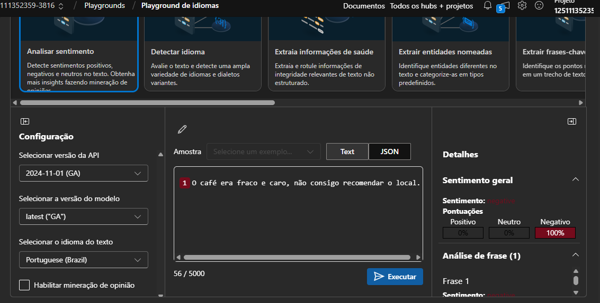
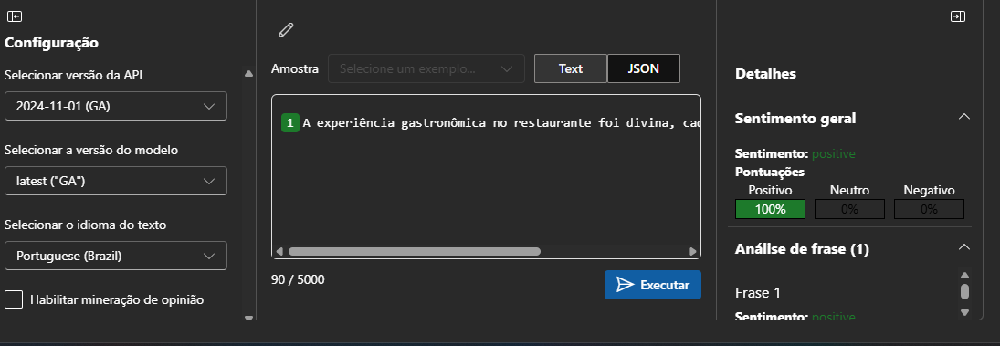
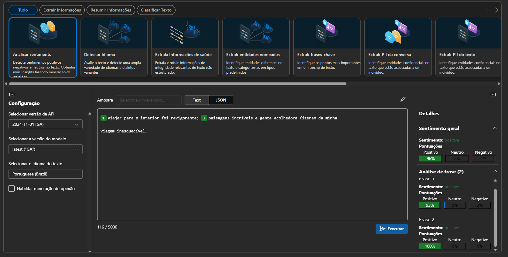
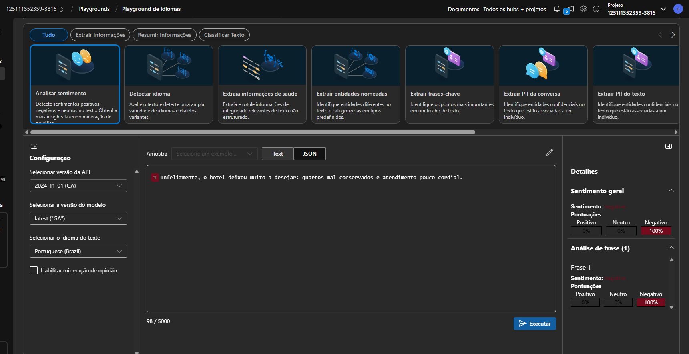
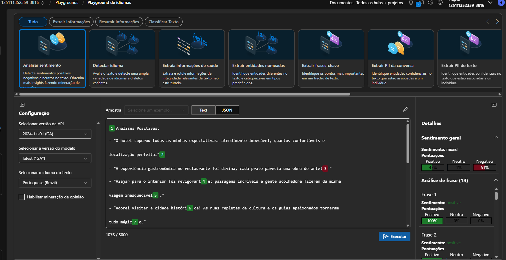

# Desafio de Projeto Microsoft AZure
## Análise de Sentimentos com Language Studio no Azure AI

### Resumo

Neste Lab nos aprofundamos mais no serviços de conversão de texto e fala por IA, fomos apresentados ao Azure Lenguage Studio
e foi mostrado como este recurso pode ser util em diversos cenarios, como análise de sentimentos, detectação de palavras chaves,
tradução de idioma, interpretação de linguagem coloquial e utilização de chat Bot, como em larga escala ter um agende de IA analisando e trazendo insights pode ser util e reduzir muito o trabalho
manual de verificar avaliação por avaliação

###  Lab - testando o serviço
Criei algumas sentanças e pedi para o Azure analizar, ele entendeu as sentaças negativas e as positivas, porém acredito eu
que por questões de idiomas, ele pegou acentuação de dividiu algumas sentaças em duas frazes algumas com poucas letras e as classificava como negativas,
provavelmente por questão da ascentuação da lingua portuguesa ser mais complexa, mas acredito que seja um pequeno ponto de melhoria

### Prints de algumas analises

