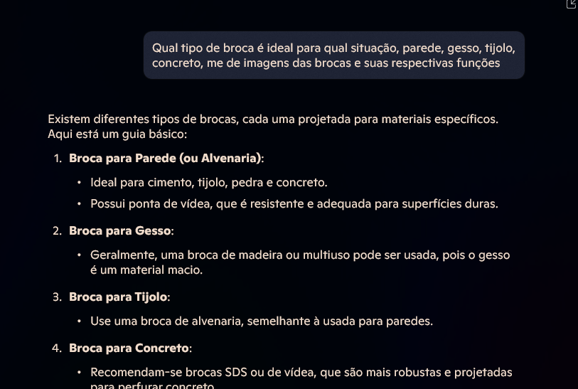
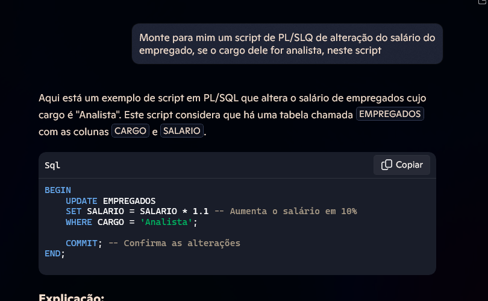
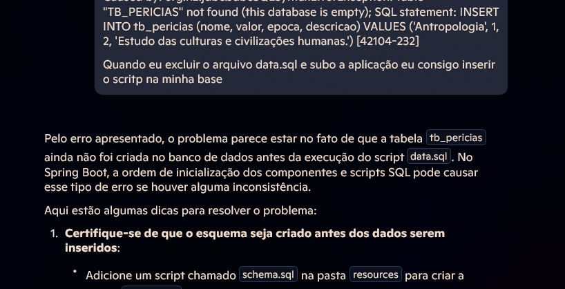

# Desafio de Projeto Explorando os Recursos de IA Generativa com Copilot e OpenAI

## IA generativa Responsavel 
### Resumo do conteudo aprendido 
Quando falamos sobreIA Generativa Responsável, estamos falando sobre planejamento dessas soluções de Ia, quando falamos de IA,
estamos falando sobre dados, e com isso temos que garantir a qualidade e segurança destes dados. Tem quatro fases do 
processo para desenvovler e implementar um plano de Ia responsavel, são eles : Identificar, Midida, Mitigar e Operar

Identificar: Possiveis danos relevantes para a solução planejada

Medida: A presença desses danos nas saidas geradas pela solução
Mitigar: Os danos em váias caadas em sua solução para minimizar a presença e impacto deles
Operar: A solução com responsabilidade definindo e seguindo um plano de implantação e de preparação operacional

O Microdoft Copilot não é apenas uma IA generativa de textos, ele nos traz diversas funcionalidades, algumas ainda não estão
disponiveis para todo mundo e necessitam de liberação ao usuario, 
somo capazes de realizar diversos tipos de pesquisa, geração de imagem e código.

### Exemplos de consulta

### Links passo a passo do Microsoft COpilot e Azure OpenAI
* [Copilot](https://aka.ms/ai900-bing-copilot)
* [Azure OpenIA](https://aka.ms/ai900-azure-openai)
* [Flters](https://aka.ms/ai900-content-filters)